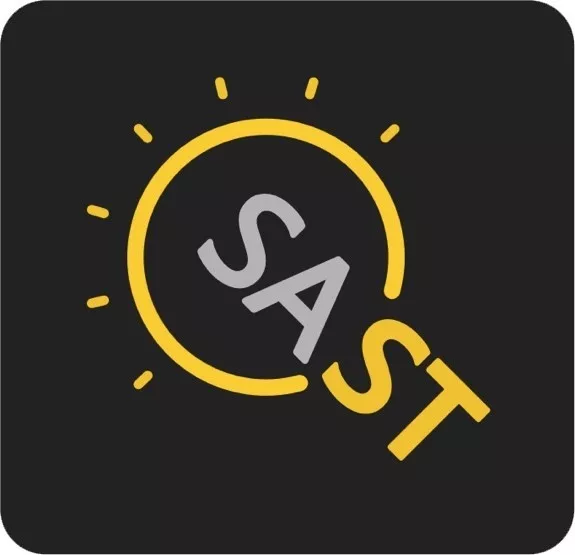

# 1998 大事记

8月11日：教育部批复，本校除建筑学专业外，原来5年制本科改为4年制。



**一九九八**

正值我系建系40周年，校庆当天一千余名校友返系欢聚一堂，共同参加建系40周年庆祝活动。

是年，我系组建网络机房，配备SUN公司赠送的35台工作站;组建Intel教学机房，配备Intel公司赞助的35台奔腾II及一台服务器;投资40万元改造系局域网，实现了千兆到楼层、百兆到桌面的连接速度。10月，我系进行机关机构改革，同时开展学科规划及学术研讨。同月，教育部批准我系计算机系统结构学科特聘教授岗位。张尧学负责的“计算机网络产品SED-08路由器”获得国家科技进步二等奖。孙家广负责的“高华CAD二维绘图及设计系统”获得国家科技进步二等奖。唐泽圣任中国计算机学会第六届理事会副理事长，王鼎兴任常务理事。吴建平任863计划306主题专家组成员。

是年，我系派队参加ACM大学生程序设计比赛，取得亚洲第一，世界第七的好成绩。由我系国际信息学奥林匹克中国队培训基地培养的中学生信息学代表队连续九年参加国际大赛，取得了优异的成绩，35人次参赛共夺得18块金牌、9块银牌、8块铜牌。我系体育代表队参加学校运动会奥运项目比赛，取得男子团体总分第一名，捧回“马约翰杯”。计研8班李凌同学当选为海淀区人大代表\(当年我校唯一的学生代表\)，李凌等同学参加美国数学建模大赛获特等奖，这是清华第一次获此殊荣。庄莉获得清华大学特等奖学金。计45班团支部获得首都高校“先锋杯”优秀团支部。

