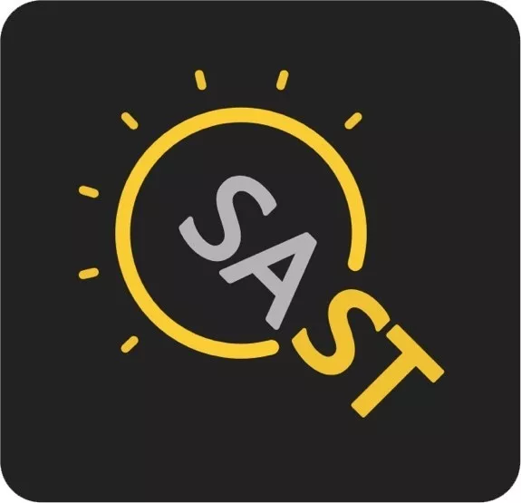

# 计算机系科协



## 计算机系学生科协介绍

计算机科学与技术系学生科学技术协会（以下简称计算机系科协）成立于1983年，是面向计算机系全体同学的学生学术科技组织。在计算机系党、团委的直接领导下，开展丰富多彩的科技活动，为同学进行课外科技创新提供多方位的服务，促进学生科技水平和创新素质的提高。目前计算机系科协下设网络部、科创部、联络部以及智能体部。

**网络部**

网络部负责管理、维护、开发面向计算机系的学生网络服务。目前网络部管理维护着酒井的所有服务器和大部分公共网络资源，其中包括9\#BBS、Accounts9用户管理服务、FTP服务、DNS服务、9\# Wiki、Git9代码管理平台、Download9离线下载服务，智能体大赛服务器等，为计算机系同学创造了优良的网络环境，并提供学习和开发的平台。

酒井网络服务列表（地址[https://wiki.net9.org/w/Net9System](https://wiki.net9.org/w/Net9System)）

**科创部**

科创部是以夯实基础、探索前沿、项目实战、科技竞赛为主要功能的部门。科创部的主要工作有：1、组织同学交流讨论，夯实专业基础，探索前沿科技；2、帮助同学找到合适的导师提前开展科创项目；3、组织同学参加学术工业界各大科技竞赛；4、为同学提供各种校内外科创活动信息和资源； 5、为同学提供技术支持和顾问。在一年一度的清华大学“挑战杯”学生课外学术科技作品竞赛中，科创部组织系内同学参加挑战，负责作品征集和评审，每年校庆科创作品展览；除此之外，在院系支持下协同联络部和国内外著名大公司一起举办科技活动比赛。

我系获得代表“挑战杯”最高荣誉的永久杯

**联络部**

联络部承担着系科协的内联、外联、培训以及调研工作。联络部开展的主要工作有：1、举办“微讲堂”等系内学术科技交流活动；2、组织IT企业参观和交流活动；3、联络国内外企业举办技术竞赛 4、与其他高校学生科协进行交流沟通 5、负责科协成员感情建设。

**智能体部**

智能体部是负责组织筹办校内三星级赛事——智能体大赛的部门。

智能体大赛是由清华大学计算机系和软件学院学生科协自主共同举办的一场面向全体编程爱好者的人工智能赛事，迄今为止已经成功举办了20届。比赛的基本形式是选手编写人工智能程序控制游戏中角色的行动，通过两个程序对抗决出胜负。 大赛的宗旨是普及人工智能的基础知识，培养同学以程序设计为手段研究和解决问题的能力，基本形式为选手设计相对简单的人工智能程序在公共平台上进行比赛。每一届智能体大赛都会涌现出大量新奇的作品，让参赛者和观众同学拍案叫绝。 在大赛中，你既可以将个人的想象力发挥到极致，尽情地燃烧思维的火花；同时又能与各路大牛们交流，开阔视野，进一步提高编程能力。

此外，智能体部也经常组织一些人工智能、计算机图形学等方面的推送和讲座。

【王小川：开放实验室】

开放实验室给他们展现了更大的世界，之后这种惊喜还将被他们带进九号楼的宿舍里，也带给千千万万的普通人。

**现在，开放实验室在清华同学中的记忆，只剩下军训选课的点滴留存，只有校园卡充值“开放实验室机时”的选项，仿佛诉说着过去的故事。**

“最早的时候，同轴线的稳定性特别差，因为网络是环形的，一个点有故障之后，整个网络就出故障了，那时候大家玩红警，那时候还不是红警，是沙丘吧，经常玩玩就卡了不动了，大家就很沮丧。后来互联网连好，能够连出去了，特别兴奋，坐在寝室里面能够收邮件了，虽然需要配置一大堆东西，但毕竟在寝室里面能收邮件了。我当时记得我的表哥是在加拿大，给他发邮件回封邮件，那个兴奋度溢于言表，**就像一直吃糠的人吃上了大米一般。**”

当时的王小川或许已有感觉，自己正参与着这个伟大事物传播和书写的历史行程。



**【周枫：酒井BBS】**

**水木清华 “枫”情酒井**

说到在清华的校园生活，周枫觉得那应该是最难忘的时段。在这个阶段，印象最深刻的事情是在学生科协工作的经历。他从大三开始担任科协主席，当时还是1998年，中国的互联网产业刚刚起步，还是学生的周枫不知不觉地参与到学校网络的初步建设当中来。由于当时学校还没有校园网，他所在的学生科协承担起一部分建设局域网的工作——买网线、铺设网线、调试交换机等等。当时周枫和他的同学在9号楼建立的局域网是国内最早的一批局域网，从这里也诞生了目前大家常用的酒井BBS。当时的女生楼是7号楼，由于很难在7号楼进行网线铺设工作，因此周枫他们将网线由空中直接从9号楼连接到7号楼2层的一个房间，这样也保证了计算机本系的女生能够上酒井BBS。

提起这段时光，周枫说：“这个阶段对我产生了很深刻的影响，我学会了如何计划并与他人合作完成一些事情，同时从中收获了如何将一个想法变成现实。”



**1996年进入清华的周枫，常常想起当年在科协一起给宿舍楼组建局域网的经历。**

那时宿舍区还没有网络，主楼后的开放实验室是清华人接入互联网世界的唯一渠道。计算机系同学们计划将宿舍同互联网连接起来。他们得到了老师的大力鼓励和支持。

“这也是清华最特别的地方，如果你把很多不同组织对比起来看的话，清华在这方面是非常突出的。**老师们都非常懂行，而且非常支持各种各样的创新**。”

要到一笔资助，自己研究怎么组装，自己做网线头，自己钻孔，干一个星期，小小的宿舍和互联网从此紧紧相连。

那是一个BBS和email的时代，大家如饥似渴地享受着信息互联带来的便利，周枫有了自己的hotmail，5位数的用户名，可以给感兴趣论文的作者发邮件，这种体验令他记忆犹新。

他们还有了自己的酒井BBS。**现在登录酒井BBS，还能看到当年争鸣和交流的遗迹。他们在上面讨论时事、身边事、功课，从诗词歌赋聊到人生哲学。**周枫至今收藏着当年BBS内容编撰的文集。

计算机系的女生们常常需要到九号楼上网，周枫做系科协主席时，在七号楼和九号楼之间架起了网线，**网线连起了计算机系，也连起了周枫和妻子庄莉**。

周枫和庄莉同级同班。他们的新生舞会是在食堂举办的，二十年前的同学采用了把桌椅移走，在食堂办舞会的实用主义策略，舞乐轻扬，桌椅环绕，四方喧嚷，那是两人的初识。

但他们真正认识是在高数课上。他们一起被叫到黑板前写答案。

“大家基于高中的习惯，一度还是很关心成绩的，每个班考试比较好的几个人会比较熟，都会知道，**我们俩是第一、第二这种情况。**”

后来，各种各样的事他们都会碰上。

“**其实我觉得大学是找到心爱人的很好的环境，或者甚至是最好的环境。**”周枫笑着说。大二的他们，常常会在三教前的小广场一起自习。周枫回想起一次非常“羞辱”的经历，“去参加北京市物理竞赛然后就发现全不会，完了之后庄莉说好容易。”

**周枫和庄莉分别于1999年，1998年获得清华大学本科生特等奖学金。而当年，这项荣誉每年只授予5名清华本科生。**

**【王小川：智能体大赛】**

王小川大学时担任了计算机系的科协主席，后来在校科协担任副主席。他坦言，在学校社工三大组织中，科协是比较弱势的一个，但是“我愿意做一些实实在在的跟科技相关的工作，把它做到极致还是很有意义。”“科协要起衔接作用，真正让大家爱科学爱技术。”

王小川在科协的那段日子，与一群志同道合的同伴做了很多开创性的工作。在计算机系时创办了智能体大赛，一直延续至今。他仍然记得在第一届的坦克大战中，现场气氛非常热烈，大家围观机器人打仗，体会智能性。建立了网络，为后来的科协工作起到了革命性的影响。

“因为我们仨（王小川，周枫，庄莉）那时候是一个队的，参加一个好像是数学建模比赛，然后三个人轮流干活，他俩就能一起玩了，郁闷死了。**后来拿了一等奖**。”

回忆大学的日子和智能体竞赛的点点滴滴，王小川感觉一切都历历在目。

“我们最后就做成像坦克的比赛，每方5个坦克，如果完全适时坐标运算的话运算量太大了。当时我就说，看着好像是一个无缝，没有棋盘的，但背后其实一格格的空间，原来搞OI\(信息学竞赛\)，我很知道怎么使用运算力，然后就把它变成一个看着效果很好，但实际背后很精简的一个模型，其实复杂度也很高了，因为每方控制5个坦克，坦克有前进、后退、左转、右转，这是4个动作，同时还有另一个动作，炮塔的左转、右转，还有开炮。另外炮的距离是你视线的两倍，意思是你要打到你看不见的地方去，你还需要配合，一个坦克看见了，另一个坦克可以打，是做这么一个游戏的设计。**那会儿全靠自己开发，配音也是自己去搞，特别辛苦。**”

第一代智能体

以游戏为载体，人工智能为核心，在周枫和王小川的统筹下，智能体竞赛收获了极高关注。

**“周枫跑去把校领导请过来了，把学校媒体，电视台都请过来了，那场比赛简直现场效果极好，掌声雷动。因为人们能读懂，看得出AI是在对战，当时看完之后学校特别高兴，就把这个活动变成校级赛事了。”**

当时，王小川还负责信息学竞赛集训队工作：“我就把他们那次选集训队的考试题，也定了这个题，这样有评分在里面，集训队就会拼了命做这个题目。”王小川说。

虽然已不再用来选拔，高中信息学竞赛选手参加智能体比赛的传统，一直延续到了今天，他们中的许多人，力压学长学姐斩获头筹的故事至今为人乐道。**在确定性算法一统江湖的年代里，智能体大赛很多时候成了编程比赛“国手”们的“AI初体验”**。

\*\*\*\*

**【周枫回忆】**

说回人工智能，周枫清楚地记得当年举办智能体大赛的点点滴滴。当时，智能体大赛还不叫这个名字，只是清华众多科创比赛中的一个普通的软件竞赛。缺少特色、反响平平的现状，令周枫不太满意：

**“那时候非常流行红警，98、99年之后大家又开始玩星际，大家玩红警就会想到说怎么自动对战，怎么取胜，但是课上学的AI就基本是关于逻辑推理的部分，如果能做游戏AI就很好玩。”**

**他们干脆地确定了比赛的主题：坦克对战。**拉赞助，画海报，搭框架，写代码，庄莉甚至联系到了中央电视台的采访。决赛时，在主楼的观众人山人海。周枫还展示了当时的照片：

科协同学手绘的海报

主楼比赛时热闹的景象

（格子衬衫穿越时光，是“贵系”的独特标志）

第二年，他们把比赛更名为“智能体”。**“智能体”（Agent）是人工智能的术语，表示那些独立的能够决策并可以同环境交互的实体。**

或许他们自己当时也没有想到，智能体对抗的主题将会一直传承20年，成为计算机系同学的人工智能启蒙课和一代代计算机系科协同学的集体记忆，激励了一代代同学选择了人工智能的道路。

后来的事情，在追溯中国互联网史的文章中，已经是耳熟能详。163邮件，网易有道……**现在的周枫已经是网易高级副总裁，有道CEO。**追寻初心，他们还在探索如何用包括人工智能在内的新技术带给世界更多的可能。

现在，智能体大赛已经形成了包括集中展示清华人工智能研究成果的**智能体晚会、智能体贺岁赛、智能体系列赛**在内的一系列赛事和展示活动。游戏形式也从曾经简陋的坦克对战，到如今MOBA，STG在内各种各样的游戏品类，甚至有了3D效果。

**智能体比赛的发展，也成为计算机系科协和人工智能研究一代代传承的缩影。**

\*\*\*\*

\*\*\*\*

\*\*\*\*

\*\*\*\*

\*\*\*\*

